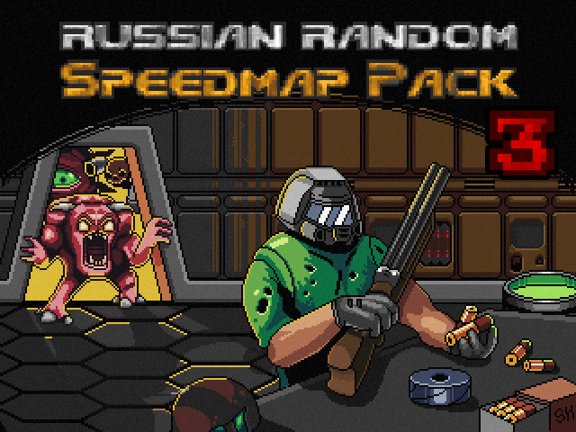
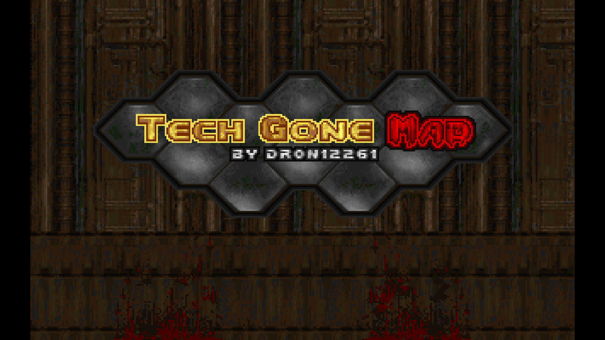
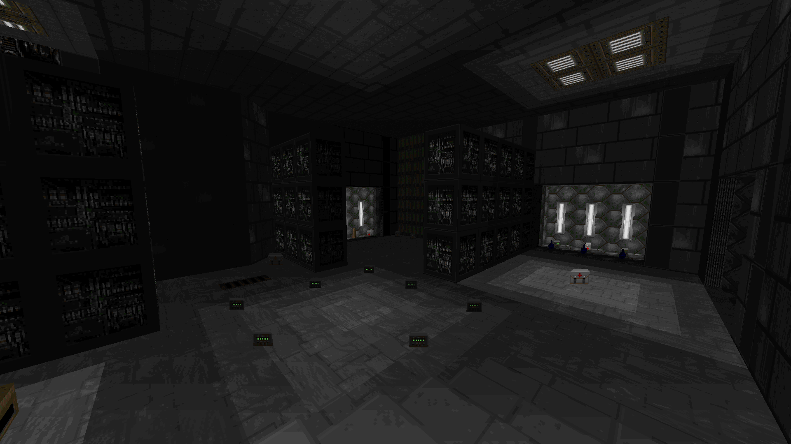

# Russian Random Speedmap Pack 3 [Community Project, 64 maps]

The biggest community project organized by me for russian doom community

# STATUS: ✅RELEASED

### Download - [Latest Release](https://github.com/dron12261games/CPL-RRSP1/releases/download/v1/RRSP1.zip)

# Links (all information inside)
- [Official Site](https://rrsp3.github.io)
- [Doomworld](https://www.doomworld.com/forum/topic/146673-rrsp3-available-now-the-most-ambitious-project-in-rdcs-history/)
- [Doom Power](http://i.iddqd.ru/viewtopic.php?p=141122#141122)
- [Doomer Boards](https://doomer.boards.net/thread/3616/rrsp3-available)

# Project screenshots:

# List of my maps:
- Drowsy Journey [10 hours, Eternity 4.03 UDMF, Doom 2]
- Quaked in Heat [4 hours, Boom, Doom 2]
- Tech Gone Mad [7 hours, Vanilla, Doom]
- ZX-27 Outpost [10 hours, Boom, Doom 2]
- Forgotten Eden [10 hours, MBF21, Doom 2]

# Screenshots:

## Drowsy Journey

## Quaked in Heat

## Tech Gone Mad

## ZX-27 Outpost

## Forgotten Eden

